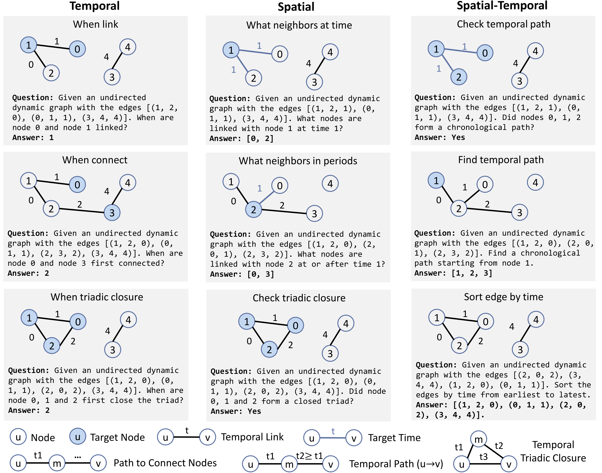

<h1 align="center">LLM4DyG: Can Large Language Models Solve Spatial-Temporal Problems on Dynamic Graphs?</h1>
<p align="center">
    <a href="https://github.com/wondergo2017/llm4dyg"></a>
    <a href="https://arxiv.org/abs/2310.17110">  </a>
    <a href="https://www.youtube.com/watch?v=uCMZQcKWSbg&list=PLn0nrSd4xjja0X85oQRfVQarMKL-pocwR&index=42"> </a>
    <a href="./paper/poster.pdf"> </a>
    <a href="./paper/talk.pdf"> </a>
</p>

This repository contains the code implementation of LLM4DyG as described in the paper: [LLM4DyG: Can Large Language Models Solve Spatial-Temporal Problems on Dynamic Graphs?](https://arxiv.org/abs/2310.17110) (KDD 2024).

## Introduction

<p align="center"></p>
<!-- <p align="center"><em>Figure 1.</em> The pipeline of LLM4DyG.</p> -->

<!-- <p align="center"></p>
<p align="center"><em>Figure 2.</em> Designed tasks in LLM4DyG.</p> -->

In an era marked by the increasing adoption of Large Language Models (LLMs) for various tasks, there is a growing focus on exploring LLMs' capabilities in handling web data, particularly graph data. Dynamic graphs, which capture temporal network evolution patterns, are ubiquitous in real-world web data. Evaluating LLMs' competence in understanding spatial-temporal information on dynamic graphs is essential for their adoption in web applications, which remains unexplored in the literature. 

In this paper, we bridge the gap via proposing to evaluate LLMs' spatial-temporal understanding abilities on dynamic graphs, to the best of our knowledge, for the first time. Specifically, we propose the LLM4DyG benchmark, which includes nine specially designed tasks 
considering the capability evaluation of LLMs from both temporal and spatial dimensions. 

Then, we conduct extensive experiments to analyze the impacts of different data generators, data statistics, prompting techniques, and LLMs on the model performance. 

## Installation
We have tested our codes with the following requirements:  
- Python == 3.9
- Pytorch == 2.2.1+cu122
- fschat == 0.2.36

Please follow the following steps to create a virtual environment and install the required packages.

Clone the repository:
```sh
git clone git@github.com:wondergo2017/llm4dyg.git
cd llm4dyg
```

Create a virtual environment:
```bash
conda create --name llm4dyg python=3.9 -y
conda activate llm4dyg
```

Install dependencies of pytorch, fschat. If running LLMs locally, install transformers==4.37.0. 

Install this repo as a library:
```bash
pip install -e .
```

## File Organization & Datasets

The files in this repo are organized as follows:

```bash
\llm4dyg
    \utils                 
        \task               # query/answer generation for each task
        prompt.py           # prompter constructor
        data.py             # data generator
        api.py              # api for querying LLMs
        ...
    runner.py               # main running script to manage data, etc.
    private.py              # openai key (if querying gpt).
\paper                      # paper framework, etc.                       
\scripts\
    \example                # example running scripts
        config.py           # arguments
        start_server.py     # running local llm servers
        run_one_instance.py # example to query one problem instance
        run_one_task.py     # example to evaluate on task
        run_tasks.py        # example to evaluate on all tasks
```

## Usage


We introduce three example scripts to run the codes.
- [run_one_instance.py](scripts/example/run_one_instance.py), example to query one problem instance
- [run_one_task.py](scripts/example/run_one_task.py), example to evaluate on task
- [run_tasks.py](scripts/example/run_tasks.py), example to evaluate on all tasks

If you want to evaluate LLMs locally, running [start_server.py](scripts/example/start_server.py) to host the LLM.

### start_server
To host the LLM locally
```bash
python start_server.py --model codellama2-13b -t run --device 0
```
The model can be the name in Huggingface.

To stop the server

```bash
python start_server.py --model codellama2-13b -t clear --device 0
```

### run_one_instance
```bash
cd scripts/example
python run_one_instance.py --task when_link --T 5 --N 10
```
see [config.py](scripts/example/config.py) for details of the arguments

The key script in the file is 
```python
# generate data
dygen = DyGraphGenERCon()                                               # data generator
obj_task = load_task(task, args)                                        # task 
dygprompt = DyGraphPrompt(obj_task, args = args)                        # prompt generator
info = dygen.sample_dynamic_graph(T = T, N = N , p = p, seed = seed)    # generate data
qa = obj_task.generate_qa(info)                                         # generate qa       
prompt_qa = dygprompt.generate_prompt_qa(**qa)                          # generate prompt qa
print('#'*10,'prompt_qa:\n', prompt_qa)

# generate response
model = args.model
prompt = prompt_qa['prompt']
answer = send_prompt(model, prompt, temperature = args.temperature, max_tokens = args.max_tokens)
print('#'*10,'answer:\n', answer)

# score
metric = obj_task.evaluate(qa, answer["content"])
print('#'*10,'metric:\n', metric)
```

### run_one_task
This script save the queries and answers for each problem instance in files for a given task.
```bash
cd scripts/example
```
see [config.py](scripts/example/config.py) for details of the arguments

to generate data
```bash
python run_one_task.py --task when_link --T 5 --N 10 -t gen --num_seed 100
```

to check data
```bash
python run_one_task.py --task when_link --T 5 --N 10 -t check
```

to run model
```bash
python run_one_task.py --task when_link --T 5 --N 10 -t run --model codellama2-13b
```

to evaluate model
```bash
python run_one_task.py --task when_link --T 5 --N 10 -t eval --model codellama2-13b
```
### run_tasks
This script save the queries and answers for each problem instance in files for all tasks. The usage is similar to run_one_task.py

to generate data
```bash
python run_tasks.py  --T 5 --N 10 -t gen
```

to run model
```bash
python run_tasks.py  --T 5 --N 10 -t run --model codellama2-13b
```

to show results
```bash
python run_tasks.py --T 5 --N 10 -t eval --model codellama2-13b
```

If you want to change the construction of data, task or prompt, just make an inheritance to the class `Runner` in [runner.py](llm4dyg/runner.py) or other related classes. 


## Acknowledgements

The APIs for making queries to LLMs are based on [fastchat](https://github.com/lm-sys/FastChat). We sincerely appreciate their contributions to the research community.

## Reference

If you find our repo or paper useful, please star the repo or cite our paper:
```bibtex
@inproceedings{zhang2023LLM4DyG,
  title={LLM4DyG: Can Large Language Models Solve Spatial-Temporal Problems on Dynamic Graphs?},
  author={Zeyang Zhang and Wang, Xin and Zhang, Ziwei and Li, Haoyang and Qin, Yijian and Zhu, Wenwu},
  booktitle={Conference on Knowledge Discovery and Data Mining (ACM SIGKDD)},
year={2024}
}
```

## Contact

If you have any questions, please feel free to contact us (zy-zhang20@mails.tsinghua.edu.cn) or (wondergo2017@gmail.com) 
